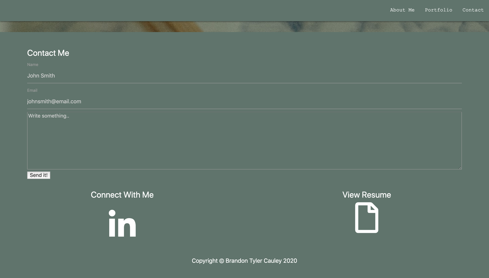
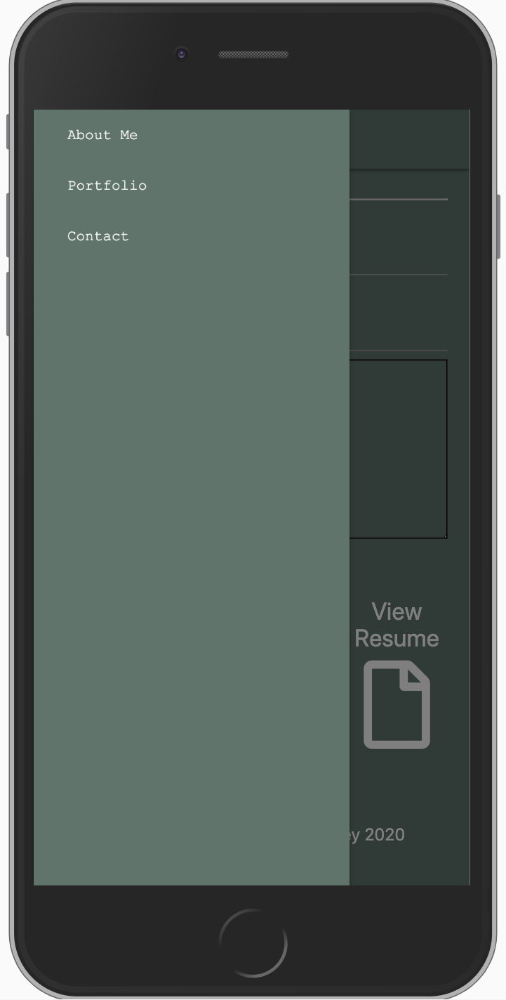

# Portfolio
Mobile first portfolio, this is a simple, clean one page portfolio that is divided into sections.

## Technologies
<ul>
<li>HTML</li>
<li>JavaScript</li>
<li>Materialize - Framework Library</li>
</ul>

## Desktop

## Mobile

View my deployed site here:

 https://tcauley91.github.io/Portfolio/
 
 
